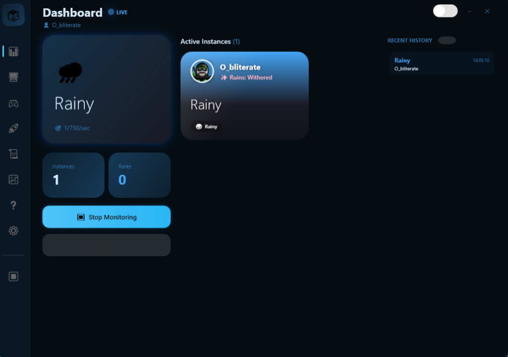

# 🎲 RNGsus - Sol's RNG Multi-Instance Tracker

<div align="center">


*May RNGsus bless your rolls* ✨


**The ultimate biome tracking tool for Sol's RNG on Roblox**

[Features](#-features) • [Installation](#-installation) • [Usage](#-usage) • [Screenshots](#-screenshots)

</div>

---

## ✨ Features

### 🌍 **Real-Time Biome Detection**
- Automatically detects current biome across all Roblox instances
- Visual biome-colored cards with gradient backgrounds
- Rare biome alerts with desktop notifications

### 🖥️ **Multi-Instance Support**
- Track unlimited Roblox instances simultaneously
- Per-instance biome tracking with user avatars
- Automatic window alignment in borderless grid

### 🎮 **Anti-AFK System**
- ViGEmBus integration for focus-free input
- Configurable jump, walk, and spin actions
- Works while Roblox is in the background

### 🚀 **Performance Optimizations**
- Per-instance CPU limiting (10-95%)
- Automatic CPU throttling when idle
- Memory optimization tools
- Process priority management

### 📊 **Statistics & History**
- Complete biome detection history
- Beautiful graphs with spawn rate analytics
- Export your biome luck data

### 🛒 **NPC Detection**
- Mari Merchant spawn detection
- Jester NPC tracking
- Visual badges on instance cards

---

## � Screenshots

<div align="center">



*Dashboard with live biome tracking and instance management*

</div>

---

## �📥 Installation

### Requirements
- Windows 10/11
- .NET 8.0 Runtime ([Download](https://dotnet.microsoft.com/download/dotnet/8.0))
- ViGEmBus Driver (optional, for Anti-AFK) - can be installed from within the app

### Quick Start
1. Download the latest release from [Releases](https://github.com/0bl1terate3/RNGsus/releases)
2. Extract the ZIP file
3. Run `BiomeMacro.exe`
4. Launch Roblox and join Sol's RNG
5. Click **Start Monitoring** in RNGsus

---

## 🎯 Usage

### Dashboard
The main dashboard shows:
- **Hero Card** - Current featured biome with spawn chance
- **Instance Grid** - All active Roblox instances with their biomes
- **Recent History** - Latest biome detections

### Anti-AFK Setup
1. Navigate to the **Anti-AFK** page (🎮)
2. Install ViGEmBus if not already installed
3. Configure your preferred actions (Jump, Walk, Spin)
4. Enable Anti-AFK per instance

### Window Alignment
Click **Align Windows** to automatically arrange all Roblox windows in a neat borderless grid layout.

### CPU Optimization
1. Go to **Optimizations** page (🚀)
2. Enable global CPU limiting or configure per-instance
3. Use "Auto" mode for smart throttling

---

## 🛠️ Building from Source

```bash
# Clone the repository
git clone https://github.com/0bl1terate3/RNGsus.git

# Navigate to project
cd RNGsus/BiomeMacro

# Build
dotnet build -c Release

# Run
dotnet run
```

---

## 📁 Project Structure

```
BiomeMacro/
├── UI/
│   ├── MainWindow.xaml      # Main application window
│   └── GraphView.xaml       # Statistics graphs
├── Services/
│   ├── BiomeService.cs      # Biome detection logic
│   ├── InputService.cs      # Input simulation
│   └── MultiInstanceManager.cs
├── Models/
│   └── InstanceInfo.cs      # Instance data model
└── App.xaml                 # Styles & themes
```

---

## ⚠️ Disclaimer

This tool is for educational purposes. Use responsibly and in accordance with Roblox's Terms of Service. The developers are not responsible for any consequences resulting from the use of this software.

---

## 📄 License

This project is licensed under the MIT License - see the [LICENSE](LICENSE) file for details.

---

<div align="center">

**Made with ❤️ for the Sol's RNG community**

</div>
